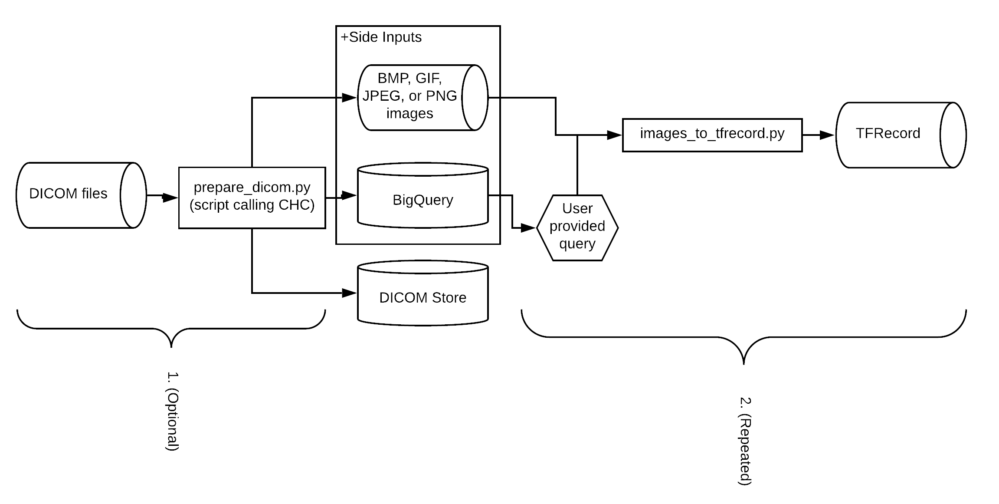
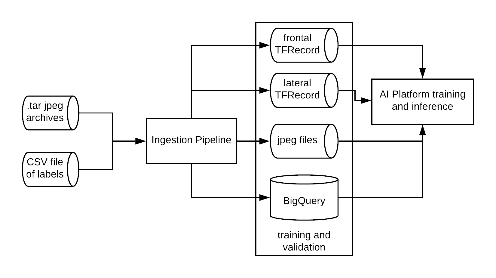
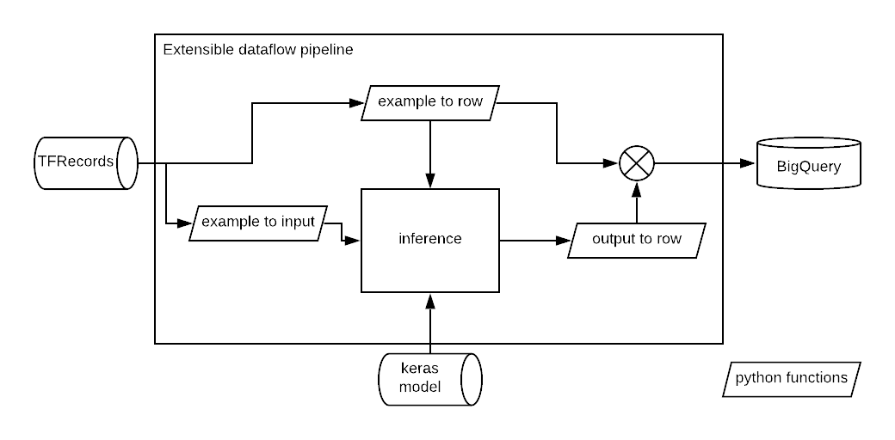

# Pipelines for transforming healthcare datasets

[Cloud Dataflow](https://cloud.google.com/dataflow/) pipelines for processing
medical imaging datasets. For organizers to prepare their datasets before
datathons.

# Generic Imaging Ingestion Pipeline



Convert a labelled image dataset into a
[TFRecord](https://www.tensorflow.org/api_docs/python/tf/data/TFRecordDataset)
dataset.

Example usage

```
python2 generic_imaging/images_to_tfrecord.py --help
```

```
python2 generic_imaging/images_to_tfrecord.py
--gcs_input_prefix gs://bucket/jpgs/
--image_format jpg
--output_image_shape 320 320
--path_match_regex='.*\.jpg'
--query='
SELECT
  path, label_1, label_1
FROM `project.bigquery_dataset.bigquery_table`
' \
--output_tfrecord_prefix gs://bucket/resized_tfrecords \
--project project \
--runner DataflowRunner \
--temp_location gs://bucket/scratch/
```

We've also provided pipelines for decompressing files so that they can be fed
into `generic_imaging/images_to_tfrecord.py`. See

```
python2 generic_imaging/decompress_gcs.py --help
```

and

```
python2 generic_imaging/untar_gcs.py --help
```

# MIMIC CXR Ingestion Pipeline



Convert the raw
[MIMIC CXR dataset](https://physionet.org/physiobank/database/mimiccxr/) from
tar files (containing JPG images) and a CSV file (of labels) into

*   [TFRecords](https://www.tensorflow.org/api_docs/python/tf/data/TFRecordDataset)
    (images and labels)
*   JPG images (images)
*   A BigQuery table (labels)

Example usage

```
python2 mimic_cxr/prepare_mimic_cxr.py --help
```

```
python2 mimic_cxr/prepare_mimic_cxr.py \
--input_tars gs://bucket/mimic-cxr-raw/train_p* \
--input_csv gs://bucket/mimic-cxr-raw/train.csv.gz \
--output_bq_table project:bigquery_dataset.bigquery_table \
--output_jpg_dir gs://bucket/mimic-cxr-processed/resized_jpg/train \
--output_tfrecord_dir gs://bucket/mimic-cxr-processed/resized_tfrecord/train \
--output_image_shape 320 320
--project project \
--temp_location gs://bucket/scratch/ \
--runner DataflowRunner
```

## Schemas

*   `mimic_cxr/mimic_cxr_bigquery_labels_schema.json`: Defines the schema for
    the output BigQuery table
*   `mimic_cxr/mimic_cxr_tfrecord_schema.py`: Defines the schema for the output
    TFRecords

## Machine Learning Tutorials

This pipeline preprocesses the dataset into the format expected by
[mimic_cxr_train.ipynb](../mimic_cxr/mimic_cxr_train.ipynb), which is a tutorial
that demonstrates how to train a [keras](https://keras.io/) model to classify
the X-ray images according to their labels.

# Imaging Inference pipeline



A framework for populating a BigQuery dataset with predictions from a
[keras](https://keras.io/) model using Cloud Dataflow. This is defined in
`generic_imaging/inference_to_bigquery.py`.

To complete this framework for a particular dataset, you must define three
python functions (example_to_input, example_to_row, output_to_row) that
specialize the framework to this dataset.

We've done this for the MIMIC CXR dataset. See
`mimic_cxr/mimic_cxr_inference_to_bigquery.py`.

Example usage for the MIMIC CXR dataset

```
python2 mimic_cxr/mimic_cxr_inference_to_bigquery.py --help
```

```
python2 mimic_cxr/mimic_cxr_inference_to_bigquery.py \
--bigquery_table project:bigquery_dataset.bigquery_table \
--input_tfrecord_pattern gs://bucket/mimic-cxr-processed/resized_tfrecord/valid/* \
--keras_model gs://bucket/mimic-cxr-models/my_model.h5 \
--runner DataflowRunner \
--project project \
--temp_location gs://bucket/scratch/
```
