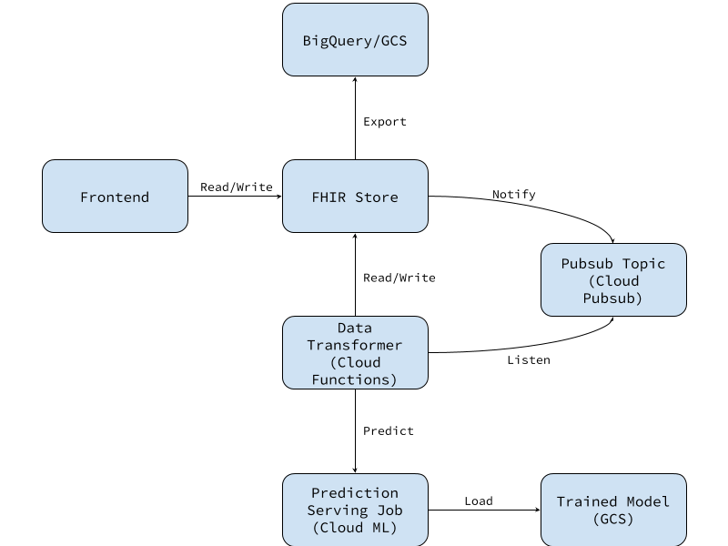

# FHIR Immunizations Demo

[TOC]

The goal of this demo is to demonstrate how to create a workflow with the
Google Cloud Healthcare API, specifically a FHIR data store. This document will
walk through how to set up a Cloud project, and how to create a web application
that implements a FHIR workflow, including machine learning and data discovery.
The web application in this project provides immunization suggestions for
countries that the user indicates they will be traveling to and allows users to
track the immunizations they have received and which ones may be coming up for
renewal.

WARNING: The predictions made by this application are presented for
the purpose of demonstrating how to integrate machine learning into a FHIR
application, and are not medical advice. The use case presented here is also
not a recommended application of machine learning on FHIR data. All data in this
demo is generated and not based on any patient health data.

Here is the architecture of the whole system.


## Getting started

### Setting up your project

Please fill in this [form](https://services.google.com/fb/forms/cloudhealthcareapiearlyaccessprogram/) to get added to the whitelist to use the Cloud
Healthcare API, if this hasn't been done yet.

First, follow the quickstart guide for the
[Healthcare API](https://cloud.google.com/healthcare/docs/quickstart) to set up
a project and configure the Cloud Healtcare API. However, instead of creating a
service account, follow the instructions on the [OAuth
quickstart](https://cloud.google.com/docs/authentication/end-user). You
will only need the client ID, the client secret (API key) is not required for
this use case. You will also need to register
`http://localhost:4200/oauth-callback` as an authorized redirect URI on the
OAuth configuration page. Change `localhost:4200` if you plan to develop on a
host or port that is different from Angular CLI's default.

### Setting up the frontend application

The application is developed using the [Angular CLI](https://cli.angular.io/).

1.  Check out this project from GitHub

  ```sh
  $ git clone https://github.com/GoogleCloudPlatform/healthcare
  $ cd healthcare/fhir/immunizations_demo
  ```

1.  Install the dependencies with `npm`

  ```sh
  $ npm install
  ```

1.  Using the dataset you created in the Healthcare quickstart, create a new
    FHIR store to be used by this application. The `TODO` values should match
    those used to create your dataset in the quickstart. The FHIR store ID can
    be any value you would like. The PubSub topic will be used later for the machine learning
    component, this can also be any identifier you would like.

    At this time the `API_VERSION` is v1alpha, but this may be different for you.

  ```sh
  $ PROJECT_ID=TODO_PROJECT_ID
  $ REGION=TODO_REGION
  $ DATASET_ID=TODO_DATASET_ID
  $ FHIR_STORE_ID=TODO_FHIR_STORE_ID
  $ PUBSUB_TOPIC=TODO_PUBSUB_TOPIC
  $ curl -X POST \
       -H "Authorization: Bearer $(gcloud auth print-access-token)" \
       -H "Content-Type: application/json; charset=utf-8" \
       --data "{
        'notificationConfig': {
          'pubsubTopic': 'projects/${PROJECT_ID?}/topics/${PUBSUB_TOPIC?}'
        }
      }" "https://healthcare.googleapis.com/${API_VERSION?}/projects/${PROJECT_ID?}/locations/${REGION?}/datasets/${DATASET_ID?}/fhirStores?fhirStoreId=${FHIR_STORE_ID?}"
  ```

1.  Create a new file at `src/environments/environment.dev.ts` with the
    configuration for your new project, replacing all the `TODO_`s with their
    appropriate values.

  ```javascript
  export const environment = {
      production: false,
      clientId: TODO_CLIENT_ID,
      fhirEndpoint: {
          baseURL: "https://healthcare.googleapis.com/TODO_API_VERSION/",
          project: TODO_PROJECT,
          location: TODO_REGION,
          dataset: TODO_DATASET_ID,
          fhirStore: TODO_FHIR_STORE_ID
      }
  };
  ```

### <a name="data-generation"></a>Data generation

This project includes a Go CLI for generating data. The recommended way to build
the CLI is to use
[bazel](https://docs.bazel.build/versions/master/install.html). This tool is
designed to generate a large amount of data for training the machine-learning
component of this application, but the number of patients generated is
configurable. Regardless of the number of patient generated there will always be
a patient with the identifier "demo-patient". This patient will be the user of
the frontend application.

1.  Run the data generation script to create one patient (the demo patient).

  ```sh
  $ bazel run //datagen:data_gen -- --num=1 --output_path=demo_data.ndjson
  ```

1.  Import the data into the FHIR store. This will be done via GCS.

    1.  Upload the data to GCS.

      ```sh
      $ gsutil -u ${PROJECT_ID?} cp demo_data.ndjson gs://${PROJECT_ID?}/demo_data.ndjson
      ```

    1.  Import the data into the FHIR store.

      ```sh
      $ curl -X POST \
          -H "Authorization: Bearer $(gcloud auth print-access-token)" \
          -d '{"gcsSourceLocation":{"gcsUri":"gs://'${PROJECT_ID?}'/demo_data.ndjson"}}' \
          "https://healthcare.googleapis.com/${API_VERSION?}/projects/${PROJECT_ID?}/locations/${REGION?}/datasets/${DATASET_ID?}/fhirStores/${FHIR_STORE_ID?}:import"
      ```

1.  Using the operation URL returned by the import request, monitor the import.
    Your data can be accessed when the operation returns `done`. Verify that
    everything has been done correctly by searching for the demo patient.

  ```sh
  curl \
      -H "Authorization: Bearer $(gcloud auth print-access-token)" \
      "https://healthcare.googleapis.com/${API_VERSION?}/projects/${PROJECT_ID?}/locations/${REGION?}/datasets/${DATASET_ID?}/fhirStores/${FHIR_STORE_ID?}/resources/Patient?identifier=demo-patient"
  ```

### Running the application

The application is now ready to be run. Simply use the Angular CLI to start a
development server.

```sh
$ ng serve
```

## Web application

### Authentication

To use access the FHIR store the application must first authenticate the user.
This is done using the [Google APIs OAuth 2
client](https://developers.google.com/api-client-library/javascript/start/start-js).
To use the Healthcare API we need to include the appropriate OAuth scope when
initializing the gapi client.

```typescript
// file: src/app/auth/gapi.ts
const HEALTHCARE_SCOPE = "https://www.googleapis.com/auth/cloud-healthcare";
// Wrap in an Angular-compatible Promise.
const authInitialization = new Promise((resolve, reject) => {
    gapi.load("client:auth2", {
        callback() {
            gapi.auth2
                .init({
                    client_id: environment.clientId,
                    ux_mode: "redirect",
                    scope: HEALTHCARE_SCOPE,
                    fetch_basic_profile: false,
                    redirect_uri: window.location.origin + "/oauth-callback"
                })
                .then(() => gapi.client.init({}), reject)
                .then(resolve, reject);
        },
        onerror: reject
    });
});
```

In this application we use the GoogleAuth object through an injection token to
make it easier to stub in tests, and to allow the application to ensure that the
gapi client is initialized before any other services or components are
initialized.

Next we create a routing guard that will check if the user is signed in and has
authorized the required scope before loading any page.

```typescript
// file: src/app/auth/authorization.guard.ts
async canActivate(_next: ActivatedRouteSnapshot, _state: RouterStateSnapshot): Promise<boolean> {
    let user: gapi.auth2.GoogleUser;
    if (!this.auth.isSignedIn.get()) {
        user = await this.auth.signIn();
    } else {
        user = this.auth.currentUser.get();
    }
    return user.hasGrantedScopes(HEALTHCARE_SCOPE);
}
```

The application can now make queries to the FHIR store.

### FHIR Store Operations

The primary actions that will be taken against the FHIR store are Create, Read
(search and get), Update and Delete. The application demonstrates each of these
operations in several places. Here we will outline the CRUD operations as
performed on the Immunization resource.

The code for interacting directly with the API is located in
`src/app/resource.service.ts`. As we will only be operating on a single FHIR
store in this application, we build the FHIR_STORE_URL in the constructor. The
value of FHIR_STORE comes from the `environment.dev.ts` file created previously.
All of the requests made by the resource service can be viewed in the
application by clicking the "bug" icon in the toolbar.

```typescript
// file: src/app/resource.service.ts
constructor(
    @Inject(FHIR_STORE) fhirStore: FHIRStore,
    @Inject(GAPI_CLIENT) private readonly client: GoogleApiClient) {
    this.FHIR_STORE_URL =
        fhirStore.baseURL +
        encodeURL`projects/${fhirStore.project}/locations/${
            fhirStore.location}/datasets/${fhirStore.dataset}/fhirStores/${
            fhirStore.fhirStore}/`;
}
```

#### Create and Update

To create a resource we do a `POST` to the appropriate resource type's endpoint.
The only required FHIR headers at this time are the FHIR JSON Content-Type, but
your use case may differ.

To create the immunization we pass the form properties to the `Immunization`
class, and serialize it to a FHIR Resource. The `Immunization` class is a
wrapper around a FHIR resource that makes setting nested properties easier by
adding getters and setters. See the `src/app/immunizations/immunization.ts` for
how the `Immunization` class is implemented.

```typescript
// file: src/app/resource.service.ts
/**
 * Creates a resource in the FHIR store with a server-assigned ID.
 * @param resource The resource data.
 * @returns The newly created resource from the server.
 */
async createResource<R extends fhir.Resource>(resource: R): Promise<R> {
  const resourceType = getResourceType(resource);
  const resourceUrl =
      this.FHIR_STORE_URL + encodeURL`resources/${resourceType}`;
  return this.performRequest<R>({
    path: resourceUrl,
    method: 'POST',
    headers: getFHIRHeaders(),
    body: resource,
  });
}

// file: src/app/immunizations/immunization-form/immunization-form.component.ts
const formData: ImmunizationFormData = this.form.value;
if (this.immunization === null) {
  const fhirImmunization = await this.resourceService.createResource(
      Immunization.fromProps(formData).toFHIR());
  imm = new Immunization(fhirImmunization);
}
```

<!-- TODO(b/119403714): rewrite if/when we use contained resources -->

The `ImmunizationFormComponent` controls editing and creating `Immunizations`,
so first we check if we are currently editing an `Immunization`. If not, we
create the `Immunization`. If the user specified a reaction to the immunization
we create an `Observation` resource and add the reference to the immunization.
The reaction has a specific ID based on the immunization's ID so that we don't
have to check what the reaction's server-assigned ID is.

```typescript
// file: src/app/resource.service.ts
/**
 * Saves a resource in the FHIR store, potentially creating it if supported by
 * the FHIR store.
 * @param resource The updated data for the resource.
 * @returns The server's new copy of the resource.
 */
async saveResource<R extends fhir.Resource>(resource: R): Promise<R> {
  const resourceType = getResourceType(resource);
  const resourceID = getResourceID(resource);
  const resourceUrl = this.FHIR_STORE_URL +
      encodeURL`resources/${resourceType}/${resourceID}`;
  return this.performRequest<R>({
    path: resourceUrl,
    method: 'PUT',
    headers: getFHIRHeaders(),
    body: resource,
  });
}

// file: src/app/immunizations/immunization-form/immunization-form.component.ts
this.updateReaction(imm, formData.reaction);

const fhirImmunization = imm.toFHIR();
if (!this.reaction) {
  // ... Handle removing the reaction
} else {
  // Use a save (PUT) operation to ensure the reaction has the ID we
  // assigned.
  await this.resourceService.saveResource(this.reaction);
}
// The reaction is guaranteed to exist on the server now, so the link won't
// fail.
await this.resourceService.saveResource(fhirImmunization);
```

#### Delete

Deleting a resource from a FHIR store only requires the resource type and ID.
The `ResourceService` accepts a FHIR resource as well for convenience. If a FHIR
store does not have `disableReferentialIntegrity` set to `false` then there must
be no resources referencing a resource if it is to be deleted. In the
`ImmunizationItemComponent` we delete first delete the immunization, as it
references the reaction `Observation`, and then delete the reaction. This could
also be done in a transaction to reduce the number of web requests.

```typescript
// file: src/app/resource.service.ts
async deleteResource<R extends fhir.Resource>(
    resource: R|string, id?: string): Promise<void> {
  let resourceType: string;
  let resourceID: string;
  if (isString(resource)) {
    resourceType = resource;
    resourceID = id!;
  } else {
    resourceType = getResourceType(resource);
    resourceID = getResourceID(resource);
  }
  this.performRequest({
    path: this.FHIR_STORE_URL +
        encodeURL`resources/${resourceType}/${resourceID}`,
    method: 'DELETE',
    headers: getFHIRHeaders(),
  });
}

// file: src/app/immunizations/immunization-form/immunization-form.component.ts
/**
 * Delete this Immunization
 */
async delete(): Promise<void> {
  // runUpdate wraps the requests to control the progress bar
  return this.runUpdate(async () => {
    await this.resourceService.deleteResource(this.immunization.toFHIR());
    if (this.reaction) {
      await this.resourceService.deleteResource(this.reaction);
    }
  });
}
```

#### Read and Search

In this application we have modelled a user's intention to visit a country as
a `QuestionnaireResponse`. This resource allows a you to create an arbitrary
answer form. There is a single `Questionnaire` that contains all of the
questions that the user is asked. We don't build the form dynamically in
Angular but it would be easy to do if the questionnaire had variable content.
To retrieve the list of travel plans we need to search for the travel plan
`Questionnaire` and retrieve all the `QuestionnaireResponses` to it. This can
be accomplished by using the `_revinclude` search parameter. `_revinclude`
tells the FHIR store to also return any `QuestionnaireResponses` that have
`questionnaire` field referencing a `Questionnaire` in the search results.

```typescript
// file: src/app/resource.service.ts
/**
 * Performs a search on resources of type `resourceType` against the FHIR
 * store.
 * @param resourceType The resource type to search upon.
 * @param queryParams Search parameters.
 * @returns The search result bundle.
 */
async searchResource(
    resourceType: string,
    queryParams?: {[key: string]: string}): Promise<fhir.Bundle> {
  const resourceUrl =
      this.FHIR_STORE_URL + encodeURL`resources/${resourceType}/`;
  return this.performRequest<fhir.Bundle>({
    path: resourceUrl,
    headers: getFHIRHeaders(),
    params: queryParams,
  });
}

// file: src/app/travel/travel-list/travel-list.component.ts
const bundle = await this.resourceService.searchResource('Questionnaire', {
  identifier: 'travel-questionnaire',
  _revinclude: 'QuestionnaireResponse:questionnaire',
});
```

#### Bundles

Bundles can be used to perform multiple actions in a single operation, either as
a `batch` or `transaction`. If the bundle type is `batch` all actions will be
performed individually, whereas `transaction` will cause one failure to fail all
other actions as well. More details can be found in the
[FHIR specification for transactions](https://www.hl7.org/fhir/http.html#transaction).

```typescript
// file: src/app/resource.service.ts
/**
 * Executes a transaction contained in `bundle` in the FHIR store.
 * @param bundle The bundle to be executed.
 * @returns The transaction result.
 */
async executeBatch(bundle: fhir.Bundle): Promise<fhir.Bundle> {
  return this.performRequest<fhir.Bundle>({
    path: this.FHIR_STORE_URL,
    method: 'POST',
    headers: getFHIRHeaders(),
    body: bundle,
  });
}

// file: src/app/immunizations/immunization-item/immunization-item.component.ts
const newImmunization = this.immunization.createUpdate();
const resource = this.immunization.toFHIR();
const bundle = {
  resourceType: 'Bundle',
  type: 'transaction',
  entry: [
    {
      request: {
        method: 'PUT',
        url: `Immunization/${resource.id}`,
      },
      resource,
    },
    {
      request: {
        method: 'POST',
        url: 'Immunization',
      },
      resource: newImmunization,
    },
  ],
};
await this.resourceService.executeBatch(bundle);
```

When an `Immunization` is updated the expired immunization is marked with a tag
to indicate that its expiry date is no longer relevant, and an identical
`Immunization` is created with an expiry in the future. The expired
`Immunization` is updated with a `PUT` request, which requires the resource ID
to be specified in the URL of the bundle entry. The new `Immunization` is
created with a `POST` request. The bundle is executed with a `POST` request to
the FHIR store.

## Machine learning on the FHIR store

Before starting on this section, please make sure Python3 and [Google Cloud
SDK](https://cloud.google.com/sdk/install) are installed.

### Model Training

A demo patient has been generated and loaded into the FHIR Store in previous
steps, however, more data is needed in order to train a model to predict the
possibility of a patient getting a specific disease. The following steps will
walk you through generating additional data for training and training the model.

1. Generate 5,000 patients and load them into the FHIR store by following the
["Data generation"](#data-generation) section above.

1. Fetch the data from the FHIR store and convert the data to the format required
by our model.

  1. Run the following command to export all the resources into GCS. This is
     necessary as it is the only to fetch all Patient/Questionnaire/Condition
     resources at this moment.

      ```bash
      $ curl -X POST \
          -H "Authorization: Bearer $(gcloud auth print-access-token)" \
          -H "Content-Type: application/json" \
          -d '{"gcsDestinationLocation":{"gcsUri":"gs://'${PROJECT_ID?}'/export"}}' \
          "https://healthcare.googleapis.com/${API_VERSION?}/projects/${PROJECT_ID?}/locations/${REGION?}/datasets/${DATASET_ID?}/fhirStores/${FHIR_STORE_ID?}:export"
      ```

  1. Use the `assemble_training_data.py` script to encode the string values in the resources to
     integers (e.g. 'female' and 'male' to 0 and 1 respectively), split the resources into
     training and evaluation groups, and assemble [a tensorflow record
     dataset](https://www.tensorflow.org/api_docs/python/tf/data/TFRecordDataset) for each data
     group.

     The Google Brain team has created a [tool](https://github.com/google/fhir/tree/master/cc/google/fhir/seqex)
     for converting FHIR resource bundles to time series, which can then be used for more advanced
     tasks. For more detail see the paper published in [Nature](https://www.nature.com/articles/s41746-018-0029-1).

     ```bash
     $ python3 assemble_training_data.py --src_bucket=${PROJECT_ID?} \
                                         --src_folder=export \
                                         --dst_bucket=${PROJECT_ID?} \
                                         --dst_folder=tfrecords
     ```

     The generated datasets can be found at `gs://${PROJECT_ID?}/tfrecords`.

  1. Train the model. Since it is a relatively simple model and there is not much data, training
     can be done locally, e.g. on a laptop.

     ```bash
     $ python3 model.py --training_data=gs://${PROJECT_ID?}/tfrecords/training.tfrecord \
                        --eval_data=gs://${PROJECT_ID?}/tfrecords/eval.tfrecord \
                        --model_dir=gs://${PROJECT_ID?}/model \
                        --training_steps=3000 \
                        --eval_steps=1000 \
                        --learning_rate=0.1 \
                        --export_model_dir=gs://${PROJECT_ID?}/saved_model
     ```

     The Cloud Machine Learning Engine is another option that can be used if your training job is
     non-trivial. Please refer to the
     [documentation](https://cloud.google.com/ml-engine/docs/tensorflow/training-overview) on how
     to submit a training job.

  1. A tensorflow [saved model](https://www.tensorflow.org/guide/saved_model#using_savedmodel_with_estimators)
     has been generated and stored in GCS. In next section, the saved model will be imported into
     Cloud Machine Learning Engine (CMLE) for prediction.

### Online Prediction

1. Import the model to CMLE by running the following command. Note that the saved models are
   stored in a directory named with a timestamp. Look up the timestamp in your GCS bucket and save
   it as an environment variable.

   ```bash
   $ TIMESTAMP=TODO
   $ MODEL=devdaysdemo
   $ VERSION=v1
   $ gcloud ml-engine models create ${MODEL?}
   $ gcloud ml-engine versions create ${VERSION?} \
       --model ${MODEL?} \
       --origin gs://${PROJECT_ID?}/saved_model/${TIMESTAMP?}
   ```

2. Run the `predict.py` script to verify the prediction works as expected.

   ```bash
   $ python3 predict.py --project ${PROJECT_ID?} --model ${MODEL?} --version ${VERSION?}
   ```

   The response is a JSON object, `classes` indicates the prediction the ML
   model makes, in this case, `1` means that the patient is getting the disease,
   `0` otherwise.

### Inference Module

Now we need to hook up the frontend and machine learning components that have been created in
previous steps. Here we are using Cloud Functions for its simplicity and low cost maintenance.

Run the `deploy.sh` script the code to Cloud Functions:

```bash
# PUBSUB_TOPIC should be the same as the one set in the FHIR store notification config.
$ deploy.sh --name devdaysdemo --topic ${PUBSUB_TOPIC?} --env_vars MODEL=${MODEL?},VERSION=${VERSION?}
```

It may take 1-2 minutes before the inference module starts working. Now try to
create a new travel plan from UI, you should see the predictions show up in a
few seconds.

## Export to BigQuery

If you want to explore the data in the FHIR store at anytime, you can export a
snapshot of all the FHIR resources in the FHIR store to BigQuery. This enables
you to query the data interactively using SQL.

1. Create a BigQuery dataset in your project, and grant the Cloud Healthcare
   Agent service account editor access to the BigQuery dataset. This service account
   is a [Google-managed service
   account](https://cloud.google.com/iam/docs/service-accounts#google-managed_service_accounts)
   that is auto-created when you enable the Cloud Healthcare API. It's in the
   format of `service-"${PROJECT_ID?}"@gcp-sa-healthcare.iam.gserviceaccount.com`.

2. Call the ExportResources API method to specify the source and
   destination locations for the export operation.

   ```bash
   $ curl -X POST \
       -H "Authorization: Bearer $(gcloud auth print-access-token)" \
       -H "Content-Type: application/json" \
       -d '{
         "bigqueryDestinationLocation": {
           "projectId":"'${BIGQUERY_PROJECT_ID?}'",
           "datasetId":"'${BIGQUERY_DATASET_ID?}'"
         }
       }' "https://healthcare.googleapis.com/${API_VERSION?}/projects/${PROJECT_ID?}/locations/${REGION?}/datasets/${DATASET_ID?}/fhirStores/${FHIR_STORE_ID?}:export"
   ```

   The export request will return an operation name that you can use to poll
   the status of the export operation.

   ```bash
   $ curl -H "Authorization: Bearer $(gcloud auth print-access-token)" \
       "https://healthcare.googleapis.com/${API_VERSION?}/${OPERATION_NAME?}"
   ```

   The response will include the details of the export operation
   when it finishes.

The result of the export operation will be a set of per-resource-type
tables in the specified BigQuery dataset. The schema of each table is
dynamically constructed based on the protobuf data structure of the FHIR
resources of that type in your FHIR store.

You can now explore the tables using SQL queries. Here are some examples:

```sql
# Patient population born after 1970-01-01.
#standardSQL
SELECT COUNT(*)
FROM `${BIGQUERY_PROJECT_ID?}.${BIGQUERY_DATASET_ID?}.${PATIENT_TABLE?}`
WHERE SAFE_CAST(patient.birthDate.valueUs AS INT64) > 0;

# Patient population sliced by gender.
#standardSQL
SELECT patient.gender.value, COUNT(*)
FROM `${BIGQUERY_PROJECT_ID?}.${BIGQUERY_DATASET_ID?}.${PATIENT_TABLE?}`
GROUP BY patient.gender.value;

# Condition count sliced by onset disease.
#standardSQL
SELECT disease.code.value, COUNT(*)
FROM `${BIGQUERY_PROJECT_ID?}.${BIGQUERY_DATASET_ID?}.${CONDITION_TABLE?}`
CROSS JOIN UNNEST(condition.code.coding) AS disease
GROUP BY disease.code.value;

# Resolved condition count sliced by patient gender.
#standardSQL
SELECT COUNT(*), p.patient.gender.value
FROM `${BIGQUERY_PROJECT_ID?}.${BIGQUERY_DATASET_ID?}.${CONDITION_TABLE?}` AS c
JOIN `${BIGQUERY_PROJECT_ID?}.${BIGQUERY_DATASET_ID?}.${PATIENT_TABLE?}` AS p
ON SUBSTR(c.condition.subject.reference.value, 9) = p.patient.id.value
WHERE c.condition.clinicalStatus.value = 'RESOLVED'
GROUP BY p.patient.gender.value;
```

These BigQuery schemas are lossless schemas. They include all the data, but
structurally they are somewhat cumbersome to query. We are collaborating
closely with the FHIR community to refine the [desired SQL projection of FHIR
resources](https://github.com/rbrush/sql-on-fhir/blob/master/sql-on-fhir.md)
that are suitable for analystics work. We have prepared a sample BigQuery
dataset in the analytics schemas for you to explore.

The query for the analytics schemas will be slightly simplified:

```sql
# Patient population born after 1970-01-01.
#standardSQL
SELECT COUNT(*)
FROM `${BIGQUERY_PROJECT_ID?}.${BIGQUERY_DATASET_ID?}.${PATIENT_TABLE?}`
WHERE birthDate.valueUs > 0;

# Patient population sliced by gender.
#standardSQL
SELECT gender.value, COUNT(*)
FROM `${BIGQUERY_PROJECT_ID?}.${BIGQUERY_DATASET_ID?}.${PATIENT_TABLE?}`
GROUP BY gender.value;

# Condition count sliced by onset disease.
#standardSQL
SELECT disease.code.value, COUNT(*)
FROM `${BIGQUERY_PROJECT_ID?}.${BIGQUERY_DATASET_ID?}.${CONDITION_TABLE?}`
CROSS JOIN UNNEST(code.coding) AS disease
GROUP BY disease.code.value;

# Resolved condition count sliced by patient gender.
#standardSQL
SELECT COUNT(*), p.gender.value
FROM `${BIGQUERY_PROJECT_ID?}.${BIGQUERY_DATASET_ID?}.${CONDITION_TABLE?}` AS c
JOIN `${BIGQUERY_PROJECT_ID?}.${BIGQUERY_DATASET_ID?}.${PATIENT_TABLE?}` AS p
ON c.subject.patientId.value = p.id.value
WHERE c.clinicalStatus.value = 'RESOLVED'
GROUP BY p.gender.value;
```
