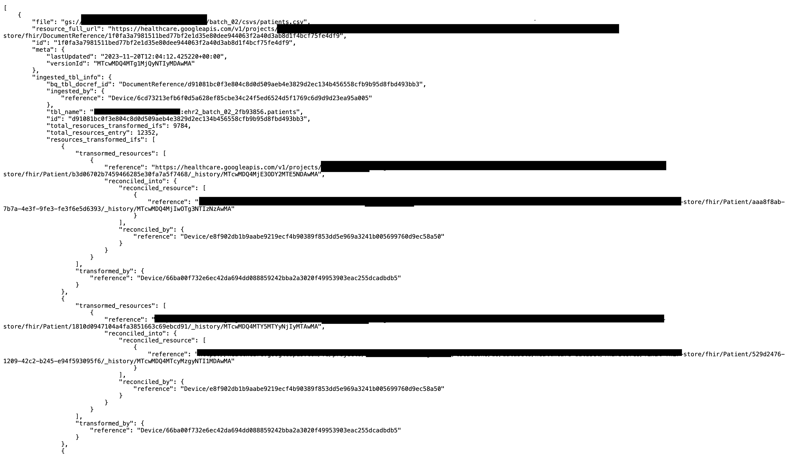

# FHIR Resources Audit

In accordance with FHIR specifications, provenance data for data lineage is stored using three different FHIR resources, Provenance, DocumentReference, and Device The goal of this project is to create a utility that will take minimal inputs from the user and provide a detailed easy interpretation to get information about how source data gets ingested, transformed and reconciled into final FHIR resources.


## Before this Utility:

##### For FHIR and CDA batch pipelines:

1. Query operational-fhir-store to fetch DocumentReference ID  of source data file from GCS bucket.
2. Use this fetched DocumentReference ID as a reference to query provenance resource to get the details about transformed resources in the intermediate-fhir-store
3. To get the information about which pipeline/agent transformed source data to intermediate-fhir-store, you will get Device ID in the Provenance resource information which can be used to query Device resource and dataflow pipeline details.
4. To get information about reconciled resources in the final-fhir-store, you need to query the Provenance resource using intermediate-fhir-store resource ID.

##### For CSV batch pipelines:

1. Query operational-fhir-store to fetch DocumentReference ID  of source CSV data file from GCS bucket.
2. Since for CSV data harmonization, data first gets copied to Bigquery tables and from there it gets transformed into FHIR resources, get the details of DocumentReference ID  of Bigquery table using fetched DocumentReference ID  of source CSV data file.
3. Performed the same steps as for FHIR and CDA batch pipelines using DocumentReference ID of the Bigquery table.
4. Use this fetched DocumentReference ID of BQ table as a reference to query provenance resource to get the details about transformed resources in the intermediate-fhir-store.
5. To get the information about which pipeline/agent transformed source data to intermediate-fhir-store, you will get Device ID in the Provenance resource information which can be used to query Device resource and dataflow pipeline details.
6. To get information about reconciled resources in the final-fhir-store, you need to query the Provenance resource using intermediate-fhir-store resource ID.


#### After following all the steps the user would be able to track only one single record from ingestion to reconciliation. There is no way to query multiple records for data lineage at the same time.

#### Additionally, users must be familiar with the relationships between FHIR resources like Provenance, DocumentReference, and Device to get the required details.


## After this Utility:

With this utility the user needs to configure very minimal basic information in the config file and execute the main.py as shown below.


#### To run this utility program, configure values in the constants.py file 

```
# Source file format e.g. "csv", "ndjson", "xml"
FILE_FORMAT = ""

# Source file GCS Path e.g. "gs://pgt-csv-input/ehr2/batch_02/csvs/patients.csv"
GCS_FILE_PATH = ""

# HDE Prefix e.g. "pgt"
HDE_PREFIX = ""           

# HDE env where data transformed e.g. "stage", "synth", "dev", "prod"
HDE_ENV = ""

# HDE FHIR store location e.g. "us", "us-central1", "us-east4"
FHIR_STORE_LOC = ""


# Local file path for storing the output e.g. "output.json", "/home/user/output.json"
OUTPUT_FILE_PATH = ""

```

#### And Execute main.py file. 
```
python main.py
```


### That’s it!

The utility will generate a JSON document in the user-configured output file path and provide information about the generated FHIR resources.

