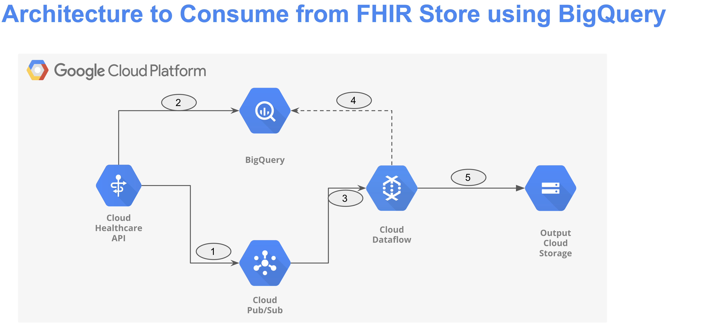

# DataFlow Streaming Pipeline to read from Healthcare API FHIR Store via BQ and write to Google Cloud Storage

The Dataflow streaming pipeline consumes Pub/Sub FHIR notification(Full Resource or NameOnly) from Google Cloud Healthcare API FHIR Store, query the data from BigQuery, and output the data to Google Cloud Storage. Users can add other sinks as per their requirements


# Architecture
 
 

 1. Configure Healthcare FHIR store to send Pub/Sub notifications. FHIR notifications are generated on each action on FHIR store (Create, Update, Delete)
 2.  Configure Healthcare FHIR store to write to BigQuery. Each FHIR resource will have there own table eg: all CarePlan fhir resources will be ingested in CarePlan BigQuery table. A BigQuery row is appended for each action on FHIR store.
 3. Dataflow reads from Pub/Sub subscription and extracts resource id. Resource id is unique identifier(eg: CarePlan/adhsff-efbhf-0dfgg) for each FHIR resource in FHIR Store.
 4. Using resource id dataflow query latest row based on last_updated timestamp from BigQuery table
 5. Finally, output is written to Google Cloud Storage

## Prerequisites 
1. [Create a Google Cloud Project](https://developers.google.com/workspace/guides/create-project) and set up appropriate billing and IAM permissions.
2. [Create a GCS Output bucket](https://cloud.google.com/storage/docs/creating-buckets) 
3. [Create a Pub/Sub topic and subscription](https://cloud.google.com/pubsub/docs/create-topic#pubsub_create_topic-Console)
4. [Create a FHIR Store](https://cloud.google.com/healthcare-api/docs/how-tos/fhir#healthcare-create-fhir-store-console)  using Healthcare API.
5. [Enable Healthcare API FHIR Store Pub/Sub notifications](https://cloud.google.com/healthcare-api/docs/fhir-pubsub)
6. [Enable Healthcare API BigQeury write stream](https://cloud.google.com/healthcare-api/docs/how-tos/fhir-bigquery-streaming)
7. More on [FHIR Resources](https://www.hl7.org/fhir/resourcelist.html)


## How to run

Below, the mentioned python command shows an example of triggering a dataflow streaming job with pre-defined parameters and values set an example  
```
python3 -m main \
    --runner DataflowRunner \
    --project project-1234 \
    --region us-central1 \
    --temp_location gs://bucket-name/tmp/ \
    --no_use_public_ips \
    --subnet regions/us-central1/subnetworks/default \
    --input_pubsub_subscription projects/project-1234/subscriptions/util-sub \
    --bq_table project-1234.fhir_dataset.CarePlan \
    --gcs_output gs://output_bucket/output/careplan
```  
