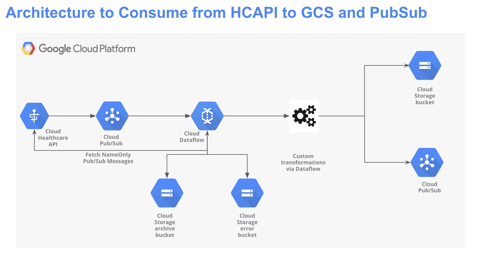
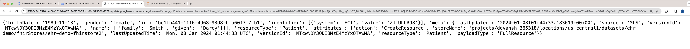

# DataFlow Streaming Pipeline to read from HCAPI, write to Google Cloud Pub/Sub and Google Cloud Storage


The goal of this DataFlow streaming pipeline (Classic standalone deployment) is to consume FHIR notification from Google Cloud Healthcare API via Google Pub/Sub, transform FHIR resources as per Business requirements and send to downstream applications via Google Cloud Storage and Google Cloud Pub/Sub.  
This solution is built using Google Cloud tools and services, such as Google Cloud Dataflow, Google Cloud Pub/Sub, Google Cloud Healthcare API and Google Cloud Storage.  
This template will help them bridge the gap between onboarding streaming sources via Pub/Sub making Healthcare FHIR resources available into Cloud Healthcare API.  
This will help users accelerate deploying streaming data pipelines from Google Cloud Healthcare API via Pub/Sub to Google Cloud Pub/Sub and Google Cloud Storage for downstream applications or business requirements.


# Architecture for the Pipeline is shown below
 
 

## Products/tools used for the pipeline

# Google Cloud Pub/Sub
Overview: Pub/Sub is an asynchronous and scalable messaging service that decouples services producing messages from services processing those messages.  
Usage: Vendors/Application (web UI, Mobile Apps, etc.) will send healthcare data events in JSON format to Pub/Sub topic  

# Google Cloud Dataflow
Overview: Dataflow is a managed service for executing a wide variety of data processing patterns. The documentation on this site shows you how to deploy your batch and streaming data processing pipelines using Dataflow, including directions for using service features.  
Usage: Dataflow will read raw healthcare data events in JSON format, parse and transform them into appropriate FHIR resources as per US Core Implementation Guide. For the sake of this example we will be creating a Patient FHIR resource.

# Google Cloud Healthcare API
Overview: The Cloud Healthcare API is a fully-managed service that makes it easy to access, process, and analyze healthcare data. It provides a RESTful API that supports a wide range of healthcare data formats, including FHIR, HL7v2, and DICOM.\n
The Cloud Healthcare API is a secure and reliable service that is compliant with HIPAA and HITECH. \n
Usage: HCAPI will be used to store transformed FHIR resources (in our case Patient FHIR resource)which will be made available for downstream applications or other processes.

# Google Cloud Storage
Usage: Google Cloud Storage will be used to archive raw healthcare data sent by the source as well as log error message occurred during transformation or while posting FHIR resource to HCAPI


## Prerequisites before cloning the repository
1. Create a Google Cloud Project and set up appropriate billing and IAM permissions. Refer following [link](https://developers.google.com/workspace/guides/create-project) for more information on how to create a GCP project.
2. Create a GCS Archive and Error bucket. Refer following [link](https://cloud.google.com/storage/docs/creating-buckets) for more information on how to create a GCS bucket.
3. Create a Pub/Sub topic and subscription. Refer following [link](https://cloud.google.com/pubsub/docs/create-topic#pubsub_create_topic-Console) for more information on how to create a Pub/Sub topic and subscription.
4. Create a FHIR store using Healthcare API. Refer following [link](https://cloud.google.com/healthcare-api/docs/how-tos/fhir#healthcare-create-fhir-store-console) for more information on how to create a FHIR store and set up necessary permissions.
5. Understanding of FHIR Resources and types of FHIR resources.Refer following [link](https://build.fhir.org/ig/HL7/US-Core/) for more information on FHIR resources and different types of FHIR resources.


# Step by Step workflow

1. Create necessary GCS Bucket, Pub/Sub topic and FHIR store as mentioned in the Prerequisites section.  

2. We will use the following parameter values as an example,
    1. GCP Project: demo-project  
    2. GCS Bucket :-  
        1. gcs_archive_bucket - ehr-demo-archive-bucket  
        2. gcs_error_bucket - ehr-demo-error-bucket  
    3. Pub/Sub Topic: projects/demo-project/topics/ehr-portal-events  
    4. Pub/Sub Subscription (will be created by default): projects/demo-project/subscriptions/ehr-portal-events-subscription  
    5. Healthcare API Dataset: ehr-demo  
    6. Healthcare API FHIR Store: ehr-demo-fhirstore  

3. We will consume the following Patient FHIR resource from Google Cloud HealthCare API once the UPDATE/CREATE/DELETE action is performed on FHIR store
    ```
    {
        "address": [
            {
                "city": "Gill",
                "country": "US",
                "district": "Franklin County",
                "line": [
                    "978 Turcotte Overpass"
                ],
                "state": "Massachusetts",
                "type": "physical",
                "use": "home"
            }
        ],
        "birthDate": "2004-07-04",
        "gender": "female",
        "id": "3820ec4a-ec08-48cd-969a-1dd9b6a32d7f",
        "identifier": [
            {
                "system": "SSN",
                "value": "999-67-4045"
            }
        ],
        "meta":{
            "lastUpdated": "2024-01-08T03:31:59.086617+00:00",
            "versionId": "MTcwNDY4NDcxOTA4NjYxNzAwMA"
        },
        "name": [
            {
                "family": "Rempel203",
                "given": [
                    "Gidget756"
                ],
                "use": "official"
            }
        ],
        "resourceType": "Patient",
        "telecom": [
            {
                "system": "email",
                "use": "home",
                "value": "sampleemail@.yahoo.com"
            }
        ]
    }
    ```

4. Before triggering Dataflow Job, Refer to the following [link](https://cloud.google.com/dataflow/docs/quickstarts/create-pipeline-python) on how to set up a GCP environment for running a Dataflow job using Python.  

5. Below mentioned python command shows an example of triggering a dataflow streaming job with pre-defined parameters and values set an example  
    ```
    python3 -m dataflow_hcapi_to_gcs_pubsub \
    --runner DataflowRunner \
    --project myehr-demo\
    --region us-central1\
    --temp_location gs://ehr-demo-dataflow-staging-bucket/tmp/ \
    --no_use_public_ips \
    --subnet regions/us-central1/subnetworks/default\
    --read_pubsub_subscription 'projects/myehr-demo/subscriptions/ehr-demo-full-fhir-resource-subscription,projects/myehr-demo/subscriptions/ehr-demo-nameonly-resource-subscription'\
    --write_pubsub_topic 'projects/myehr-demo/topics/ehr-demo-downstream'\
    --hcapi_project_id 'myehr-demo'\
    --hcapi_dataset 'ehr-demo'\
    --hcapi_version 'v1'\
    --hcapi_location 'us-central1'\
    --hcapi_get_fhir_store 'ehr-demo-fhirstore'\
    --hcapi_post_fhir_store 'ehr-demo-fhirstore'\
    --gcs_archive_bucket 'ehr-demo-archive-bucket'\
    --gcs_error_bucket 'ehr-demo-error-bucket'\
    --max_num_workers 5\
    --streaming True\
    --save_main_session True
    ```  
6. After triggering the job the dataflow will generate a Dataflow DAG

    

7. Once the data is read from PubSub read subscriptions it will stored in GCS after specified transformation as per business requirements

    

    

8. Similarly Dataflow with write the same output to downstream Pub/Sub topic used by downstream applications as shown below

    


**Note: The above example shows the leveraging Dataflow job to consume and transform FHIR resources events from Google Cloud Healthcare API, write them to HCAPI/GCS. Please update/edit the code based on your custom transformations and business requirements.**  
