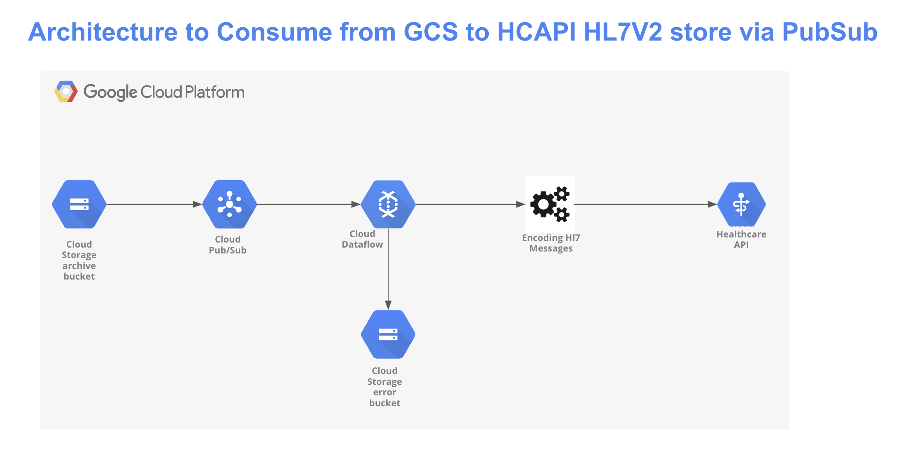
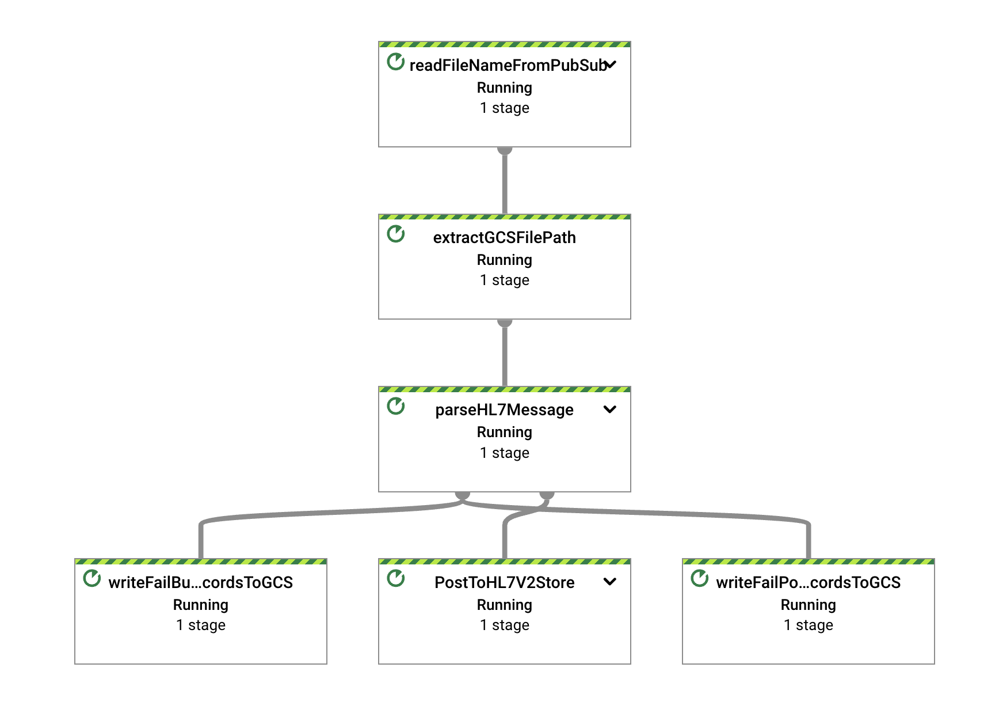

# DataFlow Google Cloud Storgae to Healthcare API HL7v2 Store Dataflow Streaming Pipeline

The goal of this DataFlow streaming pipeline (Classic standalone deployment) is to consume messages via notifications from Google Cloud Storage , transform and seperate each Hl7v2 message, encode and POST to Hl7v2 store for further transformation Healthcare API Hl7v2 Store (HCAPI Hl7V2 Store) for further processing. ingestion via Heathcare Data Engine or standalone FHIR Store which can be used for downstream application.  
This solution is built using Google Cloud tools and services, such as Google Cloud Dataflow, Google Cloud Secret Manager, Google Cloud Healthcare API Hl7v2 Store and Google Cloud Storage.  
This pipeline will help users accelerate deploying streaming data pipelines from  Google Cloud Storgae to Healthcare API HL7v2 Store enabling users to transform and store their Hl7V2 messages via streaming pipeline.


# Architecture for the Pipeline is shown below
 
 

## Products/tools used for the pipeline

# Google Cloud Pub/Sub
Overview: Pub/Sub is an asynchronous and scalable messaging service that decouples services producing messages from services processing those messages.  
Usage: Vendors/Application (web UI, Mobile Apps, etc.) will send healthcare data events in JSON format to Pub/Sub topic  

# Google Cloud Dataflow
Overview: Dataflow is a managed service for executing a wide variety of data processing patterns. The documentation on this site shows you how to deploy your batch and streaming data processing pipelines using Dataflow, including directions for using service features.  
Usage: Dataflow will read raw healthcare data events in JSON format, parse and transform them into appropriate FHIR resources as per US Core Implementation Guide. For the sake of this example we will be creating a Patient FHIR resource.

# Google Cloud Healthcare API  
Overview: The Cloud Healthcare API FHIR Store is a fully-managed service that makes it easy to access, process, and analyze healthcare data. It provides a RESTful API that supports a wide range of healthcare data formats, including FHIR, HL7v2, and DICOM.\n
The Cloud Healthcare API FHIR Store is a secure and reliable service that is compliant with HIPAA and HITECH. \n
Usage: HCAPI will be used to store transformed FHIR resources (in our case Patient FHIR resource)which will be made available for downstream applications or other processes.

# Google Cloud Storage
Usage: Google Cloud Storage will be used to archive raw healthcare data sent by the source as well as log error message occurred during transformation or while posting FHIR resource to HCAPI


## Prerequisites before cloning the repository
1. Create a Google Cloud Project and set up appropriate billing and IAM permissions. Refer to the following [link](https://developers.google.com/workspace/guides/create-project) for more information on how to create a GCP project.
2. Create a GCS Input and Error bucket. Refer to the following [link](https://cloud.google.com/storage/docs/creating-buckets) for more information on how to create a GCS bucket.
3. Create a GCS bucket event notification to Google Cloud Pub/Sub [link](https://cloud.google.com/storage/docs/reporting-changes)
4. Create a Hl7v2 Store using Healthcare API. Refer to the following [link](https://cloud.google.com/healthcare-api/docs/how-tos/hl7v2) for more information on how to create a HL7v2 Store and set up necessary permissions.
6. Understand the HL7 messages and types of HL7 messages. Refer to the following [link](https://www.interfaceware.com/hl7-message-structure#:~:text=HL7%20Messages%20are%20used%20to,require%20some%20effort%20to%20interpret.) for more information.


# Step by Step workflow

1. Create necessary GCS Bucket, Pub/Sub topic and Hl7v2 Store Store as mentioned in the Prerequisites section.  

2. We will use the following parameter values as an example,
    1. GCP Project: demo-project  
    2. GCS Bucket :-  
        1. gcs_input_bucket - gs://dev-input-hl7  
        2. gcs_error_bucket - gs://dev-error-hl7   
    3. Pub/Sub Topic: projects/demo-project/topics/dev-hl7-input  
    4. Pub/Sub Subscription (will be created by default): projects/demo-project/subscriptions/projects/hl7-input-sub  
    5. Healthcare API Dataset: hdev2   
    6. Healthcare API FHIR Store: hl7-poc  

3. We will use the following Hl7 Message payload for our example as an input which contains details such as Address, name, gender, etc This message will be stored in file my_message.hl7 on Google Cloud Storage bucket
    ```
    MSH|^~\\&|FROM_APP|FROM_FACILITY|TO_APP|TO_FACILITY|20150503223000||ADT^A01|20150503223000|P|2.5|\r
    EVN|A01|20110613083617|\r
    PID|1||21004053^^^^MRN||SULLY^BRIAN||19611209|M|||123 MAIN ST^^MOUNTAIN SPRINGS^CO^80439|\r
    PV1||I|H73 RM1^1^^HIGHWAY 73 CLINIC||||5148^MARY QUINN|||||||||Y||||||||||||||||||||||||||||20150503223000|\r
    MSH|^~\\&|FROM_APP|FROM_FACILITY|TO_APP|TO_FACILITY|19960808223000||ORU^A01| 19960808223000 |P|3.5|\r
    EVN|A01|20020713083617|\r
    PID|1||2786167615^^^^MRN||LOBO^CAREO||200611209|M|||93 JEFFERSON AVENUE^^JERSEY CITY^NJ^03690|\r
    PV1||I|H73 RM1^1^^FREEWAY 84 CLINIC||||987^WILLOVE HYSI|||||||||Y|||||||||||||||||||||||||||| 19960808223000 |\r  
    ```  

4. Message will be encoded and sent to Hl7v2 store. Refer to the following for more response [link](https://cloud.google.com/healthcare-api/docs/how-tos/hl7v2-messages#ingesting_hl7v2_messages)

5. Before triggering Dataflow Job, Refer to the following [link](https://cloud.google.com/dataflow/docs/quickstarts/create-pipeline-python) on how to set up a GCP environment for running a Dataflow job using Python.  

6. Below mentioned python command shows an example of triggering a dataflow streaming job with pre-defined parameters and values set an example  
    ```
    python3 dataflow_gcs_to_hl7v2store.py \
    --runner DataflowRunner \
    --project surjitsh-sandbox-348315 \
    --region us-central1 \
    --temp_location gs://xyz/tmp/ \
    --no_use_public_ips \
    --subnet regions/us-central1/subnetworks/default \
    --read_pubsub_subscription 'projects/demo/subscriptions/hl7-input-sub' \
    --gcs_error_bucket 'dev-hl7-error' \
    --hcapi_project_id 'demo' \
    --hcapi_dataset 'hdev2' \
    --hcapi_version 'v1' \
    --hcapi_location 'us' \
    --hcapi_hl7_store 'hl7-poc' \
    --hcapi_fhir_store 'harmonized-fhir-store' \
    --max_num_workers 5 \
    --streaming True \
    --save_main_session True \
    --requirements_file requirements.txt
    ```  
7. After triggering the job the dataflow will generate a Dataflow DAG

    

8. Uplaod file to GCS bucket and it trigger pubsub notification

9. Dataflow will read the message from Google Cloud Pub/SUb, validate, transform and encode hl7 raw message, archive it into GCS bucket and post the message to HCAPI Hl7v2 store.

10. Monitor the logs to check the sample message IDs from the hl7v2 store.

10. Drain the pipeline and stop the Dataflow job to avoid unwanted utilization of resources.

  
**Note: The above example shows the leveraging Dataflow job to ingest Hl7v2 messages, transformand POST them to HCAPI. Please update/edit the code based on your custom transformations and business requirements.**  

