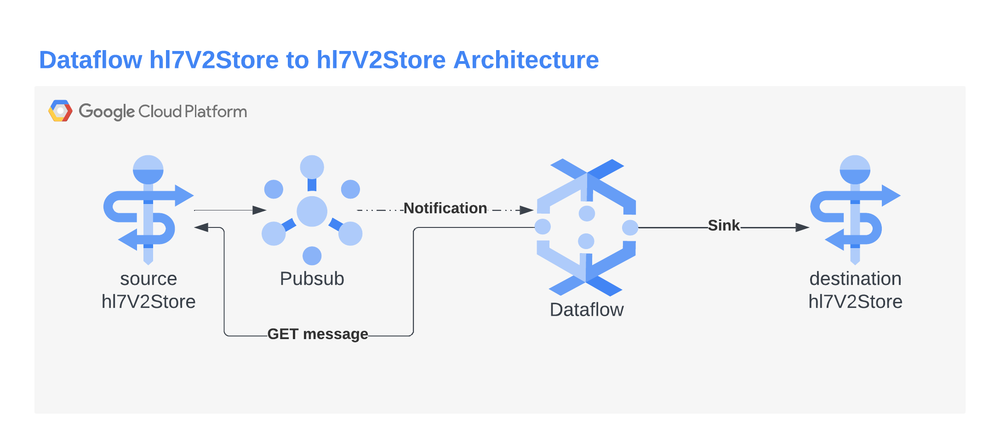

# hl7V2Store to hl7V2Store Data Pipeline
## Overview
The purpose of the hl7v2-to-hl7v2 pipeline is to stream HL7 V2 messages
from one hl7V2Store to another using a source hl7V2Store, its attached Pub/Sub Subscription and a destination hl7V2Store.
---
**NOTE**:
This is non-production demo/example code. It comes with no
guarantees and requires modification before use in any stable, durable or SLA'ed environment.
---


## Environment
This pipeline is agnostic to the location where the source and destination
hl7V2Stores sit. To read from source, it relies on the name of the hl7V2Store provided in the `name`
element of each Pub/Sub message.

Before running this pipeline, ensure the Dataflow service account has the following IAM
bindings in addition to normal Dataflow IAM:
- roles/healthcare.hl7V2StoreViewer on the source Store
- roles/healthcare.hl7V2Ingest on the destination Store
- roles/pubsub.subscriber on the source Subscription

## Build
Build the shaded JAR for Dataflow
```bash
mvn package
```

This produces ${package-name} as a JAR in the target/ directory: `target/hl7v2-to-hl7v2-shaded.jar`

## Deploy
Deploy the Dataflow Job by executing the shaded JAR.

Input parameters are:
- **Location** where dataflow will run. This is the `--project` and `--region` parameters. There is no dependency on the location dataflow runs, but generally place it in a region geographically close to the location of either of your hl7V2Stores.
- **gcpTempLocation** that dataflow will use for its internal staging and temp files.
- **sourceSubscription** that the pipeline will source real-time hl7v2 notifications. This pipeline has only been tested with a single hl7V2Store populating the Topic.
- **destinationHL7V2Store** that the pipeline will write HL7 V2 messages to.

Below is a simple bash script that can simplify the deployment of the Dataflow Job.

```bash
JAR="target/hl7v2-to-hl7v2-shaded.jar"
HOST_PRJ="dataflow-project-id"
SRC_SUB="projects/example-project-id/subscriptions/source-subscription"
DST_HL7="projects/example-dest-project-id/locations/us-central1/datasets/destination-dataset/hl7V2Stores/destination-store"
DATAFLOW_BUCKET="gs://your-dataflow-bucket-for-temp-files"

java -jar $JAR --runner=DataflowRunner --project=${HOST_PRJ} --region=us-central1 --gcpTempLocation=${DATAFLOW_BUCKET}/hl7v2-to-hl7v2/ --sourceSubscription="${SRC_SUB}" --destinationHL7V2Store="${DST_HL7}"
```
