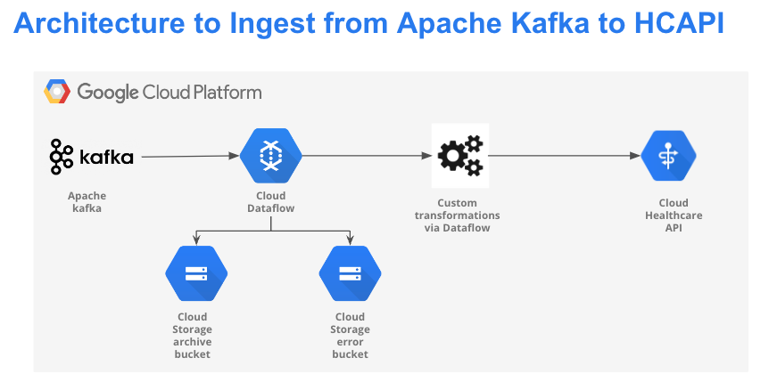

# DataFlow Kafka to Healthcare API FHIR Store Streaming Pipeline

The goal of this DataFlow streaming pipeline (Classic standalone deployment) is to consume messages via Apache Kafka, transform raw JSON messages to FHIR resource as per [U.S Core Implementation Guide](https://build.fhir.org/ig/HL7/US-Core/) (Preferential) and POST new created FHIR resources to Healthcare API FHIR Store (HCAPI R4 FHIR Store) for further reconciliation ingestion via Heathcare Data Engine or standalone FHIR Store which can be used for downstream application.  
This solution is built using Apache Kafka, Google Cloud tools and services, such as Google Cloud Dataflow, Google Cloud Secret Manager, Google Cloud Healthcare API FHIR Store and Google Cloud Storage.  
This pipeline will help users accelerate deploying streaming data pipelines from Apache Kafka to Google Healthcare API FHIR Store enabling users to transform their raw data to FHIR resources where streaming application
is applicable.  


# Architecture for the Pipeline is shown below
 
 

## Products/tools used for the pipeline

# Apache Kafka
Overview: Apache Kafka is an open-source distributed event streaming platform used by thousands of companies for high-performance data pipelines, streaming analytics, data integration, and mission-critical applications.  
Usage: Vendors/Application (web UI, Mobile Apps, etc.) will send healthcare data events in JSON format to Kafka topic  

# Google Cloud Dataflow
Overview: Dataflow is a managed service for executing a wide variety of data processing patterns. The documentation on this site shows you how to deploy your batch and streaming data processing pipelines using Dataflow, including directions for using service features.  
Usage: Dataflow will read raw healthcare data events in JSON format, parse and transform them into appropriate FHIR resources as per US Core Implementation Guide. For the sake of this example we will be creating a Patient FHIR resource.

# Google Cloud Healthcare API  
Overview: The Cloud Healthcare API FHIR Store is a fully-managed service that makes it easy to access, process, and analyze healthcare data. It provides a RESTful API that supports a wide range of healthcare data formats, including FHIR, HL7v2, and DICOM.\n
The Cloud Healthcare API FHIR Store is a secure and reliable service that is compliant with HIPAA and HITECH. \n
Usage: HCAPI will be used to store transformed FHIR resources (in our case Patient FHIR resource)which will be made available for downstream applications or other processes.

# Google Cloud Storage
Usage: Google Cloud Storage will be used to archive raw healthcare data sent by the source as well as log error message occurred during transformation or while posting FHIR resource to HCAPI

# Google Cloud Secret Manager
Overview: Secret Manager stores API keys, passwords, certificates, and other sensitive data.
Usage: To store Kafka connection details e.g bootstrap servers, Api Key and secrets if using Confluent Kafka. Dataflow will read from secret manager to extract kafka connection details.

## Prerequisites before cloning the repository
1. Create a Google Cloud Project and set up appropriate billing and IAM permissions. Refer to the following [link](https://developers.google.com/workspace/guides/create-project) for more information on how to create a GCP project.
2. Create a GCS Archive and Error bucket. Refer to the following [link](https://cloud.google.com/storage/docs/creating-buckets) for more information on how to create a GCS bucket.
3. Create a kafka producer and topic. Refer to the following [link](https://kafka.apache.org/quickstart) for more information on setting up standalone Kafka cluster,Kafka producer and topics.  
4. Create secrets using Google Cloud secret manager to store kafka server details, API key and secrets if using Confluent Kafka. Refer following [link](https://cloud.google.com/secret-manager/docs/creating-and-accessing-secrets) for more information on creating secrets using Google Cloud Secret manager.  
5. Create a FHIR Store using Healthcare API. Refer to the following [link](https://cloud.google.com/healthcare-api/docs/how-tos/fhir#healthcare-create-fhir-store-console) for more information on how to create a FHIR Store and set up necessary permissions.
6. Understand the FHIR Resources and types of FHIR resources. Refer to the following [link](https://build.fhir.org/ig/HL7/US-Core/) for more information on FHIR resources and different types of FHIR resources.


# Step by Step workflow

1. Create necessary GCS Bucket, kafka topic and FHIR Store as mentioned in the Prerequisites section.  

2. We will use the following parameter values as an example,
    1. GCP Project: demo-project  
    2. GCS Bucket :-  
        1. gcs_archive_bucket - ehr-demo-archive-bucket  
        2. gcs_error_bucket - ehr-demo-error-bucket  
    3. Kafka secrets resource name: projects/<project-number>/secrets/kafka-secrets/versions/latest  
    4. kafka topic: member-details
    5. Healthcare API Dataset: ehr-demo  
    6. Healthcare API FHIR Store: ehr-demo-fhirstore  

3. We will use the following JSON payload for our example as an input which contains [patient](https://build.fhir.org/ig/HL7/US-Core/StructureDefinition-us-core-patient.html) details such as Address, name, gender, etc which will be used for building Patient FHIR resource as per US Core Implementation Guide.  
    ```
    {"ADDRESS":"978 Turcotte Overpass","BIRTHDATE":"2004-07-04","COUNTRY":"US","CITY":"Gill","COUNTY":"Franklin County","DRIVERS":"","ETHNICITY":"nonhispanic","FIRST":"Gidget756","GENDER":"Female","HEALTHCARE_COVERAGE":3311.4399999999996,"HEALTHCARE_EXPENSES":404742.42,"Id":"7992bf94-feee-4728-9187-2c911df2819b","LAST":"Rempel203","LAT":42.63299146919133,"LON":-72.5251235198123,"MAIDEN":"","MARITAL":"","EMAIL":"sampleemail@.yahoo.com","PREFIX":"","RACE":"white","SSN":"999-67-4045","STATE":"Massachusetts","SUFFIX":"","PROGRAM_NAME":"NEW_ENROLLMENT"}  
    ```  

4. The raw patient data in JSON format will transformed into the final Patient FHIR resource attached below  
    ```
    {
        "address": [
            {
            "city": "Gill",
            "country": "US",
            "district": "Franklin County",
            "line": [
                "978 Turcotte Overpass"
            ],
            "state": "Massachusetts",
            "type": "physical",
            "use": "home"
            }
        ],
        "birthDate": "2004-07-04",
        "gender": "female",
        "id": "e2e1ce22-fef4-4e5a-adb7-80f47560d8b1",
        "identifier": [
            {
            "system": "SSN",
            "value": "999-67-4045"
            }
        ],
        "meta": {
            "lastUpdated": "2024-02-19T22:31:59.212805+00:00",
            "versionId": "MTcwODM4MTkxOTIxMjgwNTAwMA"
        },
        "name": [
            {
            "family": "Rempel203",
            "given": [
                "Gidget756"
            ],
            "use": "official"
            }
        ],
        "resourceType": "Patient",
        "telecom": [
            {
            "system": "email",
            "use": "home",
            "value": "sampleemail@.yahoo.com"
            }
        ]
    }
    ```  
5. Before triggering Dataflow Job, Refer to the following [link](https://cloud.google.com/dataflow/docs/quickstarts/create-pipeline-python) on how to set up a GCP environment for running a Dataflow job using Python.  

6. Below mentioned python command shows an example of triggering a dataflow streaming job with pre-defined parameters and values set an example  
    ```
    python3 -m dataflow_kafka_to_fhirstore \
    --runner DataflowRunner \
    --project demo-project\
    --region us-central1\
    --temp_location gs://ehr-demo-dataflow-staging-bucket/tmp/ \
    --no_use_public_ips \
    --subnet regions/us-central1/subnetworks/default\
    --topics 'member-details'\
    --kafka_secret_resource_name 'projects/123456788/secrets/kafka-secrets/versions/latest'\
    --hcapi_project_id 'demo-project'\
    --hcapi_dataset 'ehr-demo'\
    --hcapi_version 'v1'\
    --hcapi_location 'us-central1'\
    --hcapi_get_fhir_store 'ehr-demo-fhirstore'\
    --hcapi_post_fhir_store 'ehr-demo-fhirstore'\
    --gcs_archive_bucket 'ehr-demo-archive-bucket'\
    --gcs_error_bucket 'ehr-demo-error-bucket'\
    --max_num_workers 5\
    --streaming True\
    --save_main_session True\
    --requirements_file requirements.txt
    ```  
7. After triggering the job the dataflow will generate a Dataflow DAG

    

8. Publish the JSON message containing patient details mentioned in step1.  
    Below mentioned examples show how to produce messages from your Kafka shell

    1. Open your Kafka shell  
    2. Create a Kafka topic "member-details" using the following command. Update the path based on your Kafka installation path
    ```
        /opt/kafka/kafka-3.6.0-src/bin/kafka-topics.sh --create --topic member-details --bootstrap-server localhost:9092
    ```
    3. Create a Kafka Producer for the topic "member-details" using the following command. Update the path based on your Kafka installation path
    ```
        /opt/kafka/kafka-3.6.0-src/bin/kafka-console-producer.sh --topic member-details --bootstrap-server localhost:9092
    ```
    4. If the Kafka topic and producer are started successfully you can copy paste the sample payload and JSON message will be producer as shown below.  

        

9. Dataflow will read the message from kafka, validate and filter raw message, archive it into GCS bucket, build a Patient FHIR resource as per defined transformation and post the message to HCAPI as a Patient FHIR resource.
      
10. Below attach screenshot shows the raw messages archived in GCS bucket

      
    
      

11. Below attach screenshot shows the patient FHIR resource posted to HCAPI
      
      

12. Drain the pipeline and stop the Dataflow job to avoid unwanted utilization of resources.

  
**Note: The above example shows the leveraging Dataflow job to transform raw events, build FHIR resources and POST them to HCAPI. Please update/edit the code based on your custom transformations and business requirements.**  

